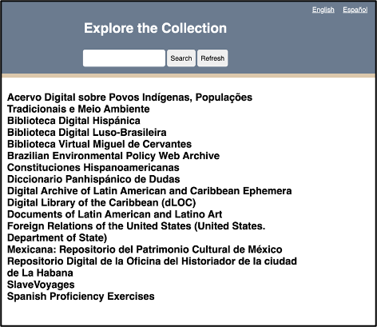

::::::::::::::::::::::::::::::::::::::: objectives

- Establish functional requirements for a web application.
- Transform a Google Sheet into a simple API endpoint with Google App Script.
- Build three JavaScript functions that filter and display your Google Sheet data on a website.

::::::::::::::::::::::::::::::::::::::::::::::::::

:::::::::::::::::::::::::::::::::::::::: questions

- Based on my data, what are the functional requirements for a simple search and discovery web app?
- What is an API endpoint?
- How can I use the JavaScript methods .get(), .filter(), and .map() to retrieve my data, filter my data, and display my data on the web app.

::::::::::::::::::::::::::::::::::::::::::::::::::

## Background

In this episode we will create a single page website that displays a search and discovery system for data on a Google Sheet using JavaScript.  You'll begin by establishing functional requirements for your project, setting clear goals and selecting free, open-source solutions. Next, you'll transform a Google Sheet into a database by converting it into a dynamic JSON-based API endpoint using Google App Script, allowing your website to retrieve data. You'll then connect your website and database via the `getData()` function to fetch data and the `displayData()` function to display the data to the user. Finally, you'll build the logic behind the search interface (`filterData()`), which will include *data normalization*, an important consideration to ensure search results match different user provided keywords (e.g., handling variations in capitalization, accents, or special characters).

:::::::::::::::::::::::::::::::::::::::::: prereq
- Copy our [LACLI Sample Data](https://docs.google.com/spreadsheets/d/19pTiNUP_PqqX0FlzMeEd5aZRWUj6lt9VU4SCwEm1f5I/edit?usp=sharing) spreadsheet to a new folder in your Google Drive. You can name this folder whatever you like.
- Download our starting code files: [webapp.zip](https://github.com/ucla-imls-open-sci/lc-multilingual-search-discovery-system/blob/main/episodes/webapp/webapp.zip)
  
::::::::::::::::::::::::::::::::::::::::::

## Functional Requirements
In any technical project, it's essential to establish clear functional requirements before diving into the technical details. This ensures that the team stays focused on the core objectives of the project, rather than getting sidetracked by fancy features or bells and whistles.

During the development of the LACLI project, we arrived at a series of functional requirements. Many of which are shared by digital projects in the humanities and social sciences:

| Functional Requirement | Solution |
| :--------: | :-------: |
| A free, intuitive, and collaborative database solution that can be easily edited by multiple volunteers without prior database knowledge.  | Google Sheets is a free, cloud-based spreadsheet solution that is intuitive to use, supports real-time collaboration by multiple users, and does not require extensive database knowledge.    |
| Free web hosting services to store and access website files. | GitHub Pages allows you to easily publish static websites directly from your GitHub repositories and use custom URL.     |
| The client-side technology should be open-source and avoid the use of front-end frameworks, which have a steep learning curve and can dissuade collaboration among those unfamiliar with a given framework.    | Vanilla JavaScript is the core programming language of the web and is open-source. It provides for collaboration and easy maintenance as it is framework independent.    |
| The user interface should allow users to search through the data using keywords and present resources in an attractive, easy-to-read format that includes links to the original resources.    | JavaScript can make API calls, filter data, and display data on a webpage by injecting HTML into the site at run time.    |
| The website must be translatable.    | JavaScript can create a translation table inside of an object to switch the site’s text content.    |

With this solution, the website data is edited and stored using Google Sheets. The added benefit is that Google already has an entire security infrastructure: you can set permission of who can view, comment, or edit files in Google Drive. Then we use JavaScript to get the data from the spreadsheet and display it on our website. The JavaScript file that does that data manipulation, as well as the HTML and CSS files that give structure and style to our site, all live in a GitHub repository and are served to the public via their GitHub Pages service.

:::::::::::::::::::::::::::::::::::::::: challenge
### Write Your Own
Based on the functional requirement assessment above, create your own two column table and list the functional requirements for your project on one side. As you progress through this lesson, note what suggestions provided here could be solutions to your specific functional requirements.

::::::::::::::::::::::::::::::::::::::::::::::::::

## Google Sheet as API Endpoint

The first technological hurtle is the fact that a Google Sheet is not automatically set up like a database. We will do this in three steps:
1. Create a Google App Script file that uses the Google Sheets API.
2. Write a script in the file that wraps all data up in a JSON.
3. Launch our script as a web app, which creates a unique API endpoint for our data and will permit our website to get that data and bring it to the user’s browser.

An API is a set of protocols that delivers data to a website. We want our site to receive the data in our spreadsheet as JSON (JavaScript Object Notation), which is a text-based data format to transmit data objects between a web server and a client-side application. When we talk about server-side, we are talking about operations that happen in the database on the servers. When we talk about client-side, we are talking about operations that occur in the user’s browser.

To activate the Google Sheet API and transform our Spreadsheet into JSON data requires creating a Google App Script file. 

In a Google Drive folder, make a copy of our [LACLI Sample Data](https://docs.google.com/spreadsheets/d/19pTiNUP_PqqX0FlzMeEd5aZRWUj6lt9VU4SCwEm1f5I/edit?usp=sharing) spreadsheet. In this folder you'll also create a Google App Script File and name it Convert Sheet to JSON. This video will show you how to create the file and add the Google Sheets API under Services:

<iframe src="https://drive.google.com/file/d/1WScfIWv2PFTf4IoY_Z01r3qIUa194Muk/preview" width="640" height="480" allow="autoplay"></iframe>

Now that the Sheets API is set up, we will instruct it to wrap up our spreadsheet data in JSON. First, in the text editing window of Google App Script, delete the default function:

```javascript
function myFunction() {
 }
```

We will replace it with the following code:

```javascript
function doGet(request) {
  var spreadsheetId = '....'; // Replace with Google Sheet ID
  var sheetName = 'Main'; // Replace with the sheet you want to retrieve data from
  // make sure the advanced sheets service is enabled for this script
  var dataValues = Sheets.Spreadsheets.Values.get(spreadsheetId, sheetName).values;
  
  // Change the index from 0 to 2 to use row 3 as column headings
  var headers = dataValues[2];
  
  var rows = [];
  for (var i = 3; i < dataValues.length; i++) { // Start from row 4, as row 3 is the column headings
    var row = {};
    for (var j = 0; j < headers.length; j++) {
      row[headers[j]] = dataValues[i][j];
    }
    rows.push(row);
  }
  
  var output = JSON.stringify(rows);
  return ContentService.createTextOutput(output).setMimeType(ContentService.MimeType.JSON);
}
```

Let's take this code step by step:<br>
1. `function doGet(request)` is a stock function in Google App Script that handles a GET request made to your script's web app URL.<br>
2. Your spreadsheetid is available in the URL for the spreadsheet. Copy the string of alphanumeric characters in the URL of your spreadsheet:<br>
<br>
3. `var headers = dataValues[2]`, set the index of where the JSON should read header names. Because in our spreadsheet we have 2 rows of contextual information, we want the JSON to start on row 3 to find column headers.<br>
4. `var rows = [],` the script will loop over all rows to add them to the JSON.<br>

The last step is launching the Apps Script web app:

<iframe src="https://drive.google.com/file/d/1h3vF1022Ksv5TrI7_gnhYYw1FcAdhnL5/preview" width="640" height="480" allow="autoplay"></iframe>

::: callout
### Keep the URL handy!

At the end of the video, you see that a red box appears around the Apps Script web app URL. This URL will act as our API endpoint and enable our discovery system to import all the data from our Google Sheet in JSON. Save this URL. You can also copy this URL into your browser, hit return, and you'll see all our spreadsheet data represented in JSON.
:::

## Get your Data: getData()
In this section we will take the API endpoint, which we created with Apps Script, and connect it to our website. We’ll then display that data on our website.

To begin, download the webapp code as a zip file: [webapp.zip](https://github.com/ucla-imls-open-sci/lc-multilingual-search-discovery-system/blob/main/episodes/webapp/webapp.zip), which contains the starting files for our website. Your file structure will look like this:

```
–webapp
	–app.js
	–index.html
	–style.css
```

Open index.html in the browser and you will see a basic structure for our discovery system. I’ve already given you some basic styling. We won’t be looking at style.css during this lesson, but feel free to modify it after. 

From top to bottom: we have our language selection buttons, which we will use in a later episode to translate our page. Then we have our search bar, search button, and refresh button. We will use these in the next episode to enable users to search through the research data by with keywords. Last, in the blank white space is where we will populate our website with our research data.


Now open the `webapp` folder in your preferred Integrated development environment (IDE). Let’s take a look at `app.js`, which will drive our site’s functionality. Right now, we only have a road map of how we will build our system:

```app.js
// Define API endpoint and DOM elements
const googleSheet = '';


// Get Data


// Filter Data


// Display Data

```

In `app.js`, we have a variable `googleSheet`. Let’s set this to the URL of the Apps Script web app by copying the URL between the single quotes. 

```app.js
const googleSheet = 'https://script.google.com/macros/s/....';
```

Now we need to have `app.js` request that our webapp send our site the JSON data. We will do this by creating our first function, `getData()`.
1. Create an object called apiData where we will store the incoming data.

```app.js
let apiData = [];
```

2. Create an async function that will make a fetch request to our Google Sheet.

```app.js
// Get data
let apiData = [];


async function getData(url) {
   const response = await fetch(url);
   const data = await response.json();
   apiData = data;
}
```

The `getData` function will use an API endpoint (the URL of our Apps Script web app) to fetch data and save it in a object called `response`. Next, we will format the response as JSON in an object called `data`. Lastly, we assign that formatted data from the fetch request as our `apiData` object.

A unique attribute of JavaScript are promises. Promises are objects that represents the eventual completion (or failure) of an asynchronous operation. Promises typically do not happen as soon as a page loads, but take some time. In our case, we assign the async keyword before declaring the getData function because we know that the request for the Google Sheet data will take some time to reach our webpage. Similarly, the await keyword is used when we make the fetch request and format our fetch response in JSON because we are anticipating that the data will not arrive when the page loads.

3. As a result of using promises, it is best practice too use the try/catch error handling block in our function in case there is some error retrieving the data. Our final getData() function should look like this:

```app.js
// Get data
let apiData = [];


async function getData(url) {
 try {
   const response = await fetch(url);
   const data = await response.json();
   apiData = data;
 } catch (error) {
   window.alert(error.message);
 }
}
```

4. Lets test to make sure we are getting the data from our Google Sheet. We can log our incoming data to the console. Right below line 7, let’s add `console.log(apiData);` Our full `app.js` should look like this:

```app.js
// Define API endpoint and DOM elements
const googleSheet = 'https://script.google.com/macros/s/...';

// Get data
let apiData = [];

async function getData(url) {
 try {
   const response = await fetch(url);
   const data = await response.json();
   apiData = data;
   console.log(apiData); //Test if data fetch is working correctly
 } catch (error) {
   window.alert(error.message);
 }
};

getData(googleSheet);
```

5. We now need to link our `app.js` file and our `index.html`. Open up `index.html` and just before the end body tag, link the `app.js` file:

```index.html
   </main>
<script src="app.js"></script>
</body>
</html>
```

6. Open `index.html` in the browser (I suggest Chrome) and open developer tools. Then click on the console tab and you should see your data in an array:

<iframe src="https://drive.google.com/file/d/1haD32ZBJpX2MTLqcu2fG4IJ0swM5Z5yQ/preview" width="640" height="480" allow="autoplay"></iframe>

::: callout
### Examine the JSON Object

Success! Lets look at this data to get a sense of what is going on. Let’s expand the first item in the array:

```console
0:
	Assuntos_em_Portugues: "Povos indígenas; Ambientalismo"
	Countries: "Brasil"
	Institutional_Hosts: "Instituto Socioambiental "
	Languages: "Português"
	Materias_en_Espanol: "Pueblos indígenas; Ambientalismo"
	Resource_Title: "Acervo Digital sobre Povos Indígenas, Populações Tradicionais e Meio Ambiente"
	Resource_Types: "Audiovisual Materials; Books; Texts (Other); Visual Materials"
	Subjects_in_English: "Indigenous peoples; Environmentalism"
	Summary: "\"O ISA possui um vasto acervo relativo a povos indígenas, populações tradicionais e meio ambiente, formado desde 1974, compreendendo diversos tipos de materiais arquivísticos, audiovisuais, bibliográficos (artigos, livros, dissertações e teses), e notícias de jornais.  O acervo está indexado por etnias, categorias de população tradicional (caiçaras, quilombolas, seringueiros), unidades de conservação, terras indígenas, biomas, bacias, temas (biodiversidade, educação e saúde indígena, energia, estradas, etnografia, florestas, mudanças climáticas, recursos hídricos, recursos minerais, política socioambiental, entre outros), sub-temas e palavras-chave.\""
	Time_Coverage: "20th century; 21st century"
	URL: "https://acervo.socioambiental.org/"
```

JSON works in key-value format. This format will be the same for every entry in our data. All the keys are exactly the column headings in our Google Sheet. This is very useful because we can call specific pieces of data about a resource in our data table by using the column headings. The values, presented within quotes, is the data per row of our data. So here we are look at all the data, for the first row in our table. So, for example, if we want to display the title of a resource in our data table, we can ask JavaScript to show us the Resource_Title for a specific row.
:::

## Display your Data: displayData()
Now let’s move to displaying this data on the website in a user-friendly format. In our `index.html` file, you will see we have a `<div>` element with the id of “display” within the `<main>` part of our document. 

```index.html
   <main>
       <div id="display"></div>
   </main>
```

To display our data, we will target `<div id="display">` in our `app.js` file and dynamically inject html containing our data here. To target this `<div>`, we will get this element by its id in `app.js`:

```app.js
const display = document.getElementById('display');
```

Now that it's targeted, we can control the html injection with a new function in `app.js` called `displayData()`:

```app.js
const display = document.getElementById('display');

// Display data
function displayData(data) {
 let dataDisplay = data.map((object) => {
   return `
<h2>${object.Resource_Title}</h2>
`;
 }).join('');  

 display.innerHTML = dataDisplay;
};
```

This function takes our data as input. It then creates an object called `dataDisplay` where we will store our formatted data for display to the user. The key part of `displayData()` is the use of the `.map()` method. In Javascript, `.map()` creates a new array from an existing array by applying a provided function to each element in the existing array. In our project, `.map` will take our data array, a create a new array, `dataDisplay`, that will take each object and format it in html, ready to be injected into `index.html`, which occurs in the last line of the code above, `display.innerHTML = dataDisplay;`

You can see what we are iterating over all the data and placing each object’s "Resource_Title" within `<h2>` tags. The map function makes it easy to specify where you’d like what piece of data within the html by calling: `object.<insert column name from spreadsheet>`. Here we are using `object.Resource_Title`.

Open `index.html` in the browser and you will see the "Resource_Title" of each object in our data array now populating the formerly blank white space below the search bar.



In our [lacli-sample-data](https://docs.google.com/spreadsheets/d/19pTiNUP_PqqX0FlzMeEd5aZRWUj6lt9VU4SCwEm1f5I/edit?usp=sharing) spreadsheet, we have a lot of other data about each resource that is useful to users:
- Resource_Types
- Languages
- Countries
- URL
- Subjects_in_English
- Materias_en_Espanol
- Assuntos_em_Portugues
- Time_Coverage
- Institutional_Hosts
- Summary

Thus, the hierarchy we apply to this data when we populate it on our website should reflect some kind of logic. For example, the "Resource_Title" should serve as a "URL" link to the resource. Below the title, we should have the "Institutional_Hosts." The rest of the data is there to describe the resource so that a user can quickly evaluate whether they are interested in a given resource. Here is one possible arrangement of this data in html:

```html
<article class="item">
    <div class="item-header">
        <h2><a href="${object.URL}" target="_blank" rel="noopener noreferrer">${object.Resource_Title}</a></h2>
        <p>${object.Institutional_Hosts}</p>
    </div>
    <div class="item-description">
        <p><span class="inline-label">Resource Types: </span>${object.Resource_Types}</p>
        <p><span class="inline-label">Subjects in English: </span>${object.Subjects_in_English}</p>
        <p><span class="inline-label">Materias en Español: </span>${object.Materias_en_Espanol}</p>
        <p><span class="inline-label">Assuntos em Português: </span>${object.Assuntos_em_Portugues}</p>
        <p><span class="inline-label">Languages: </span>${object.Languages}</p>
        <p><span class="inline-label">Countries: </span>${object.Countries}</p>
        <p><span class="inline-label">Time Coverage: </span>${object.Time_Coverage}</p>
        <p><span class="inline-label">Summary: </span>${object.Summary}</p>
    </div>
</article>
```

As we discussed above when we were just applying `object.Resource_Title`, here you can see that we can call all the different data elements per resource with this same notation. Want to call the language of the resource? `object.Languages`. Materias en Español? `object.Materias_en_Espanol`. Again, all borrowing the column headings from our Google Sheet. We wrap each resource in an article tag as it defines independent content and thus improves accessibility by providing clear structure for assistive technologies.

We can copy this html into our displayData() function like this:

```app.js
const display = document.getElementById('display');

// Display data
function displayData(data) {
 let dataDisplay = data.map((object) => {
   return `
<article class="item">
   <div class="item-header">
       <h2><a href="${object.URL}" target="_blank" rel="noopener noreferrer">${object.Resource_Title}</a></h2>
       <p>${object.Institutional_Hosts}</p>
   </div>
   <div class="item-description">
       <p><span class="inline-label">Resource Types: </span>${object.Resource_Types}</p>
       <p><span class="inline-label">Subjects in English: </span>${object.Subjects_in_English}</p>
       <p><span class="inline-label">Materias en Español: </span>${object.Materias_en_Espanol}</p>
       <p><span class="inline-label">Assuntos em Português: </span>${object.Assuntos_em_Portugues}</p>
       <p><span class="inline-label">Languages: </span>${object.Languages}</p>
       <p><span class="inline-label">Countries: </span>${object.Countries}</p>
       <p><span class="inline-label">Time Coverage: </span>${object.Time_Coverage}</p>
       <p><span class="inline-label">Summary: </span>${object.Summary}</p>
   </div>
</article>
   `;
 }).join('');  

 display.innerHTML = dataDisplay;
};
```

The CSS I’ve already provided will handle the formatting of our data, to aid in readability and reinforce our hierarchy of information. 


::: callout
### What we've accomplished so far
This flowchart recaps the key functions we've written that move the data from our spreadsheet to our website.


:::

## Filter your Data: filterData()

Up to this point, we’ve focused on connecting our site to our Google Sheet API and displaying that data in the browser. We haven’t touched the search functionality. To call this functionality searching very much anthropomorphizes the code. Humans search using a variety of emotion, reason, and what we might call algorithms to sift through information to determine what is most relevant at a given time. What our will do is much simpler and a better way to describe it is filtering the data. We will filter the data according to whether the data we have describing a resource matches or does not match the user’s keywords. For example, if a user enters the keyword “periodicals,” we want to return all resources whose "Resource_Types" include “periodicals.” 

Filtering the data will occur after the browser has received data from the Google Sheet API, the `getData()` function, and before that data is displayed on the website to the user, the `displayData()` function.

It is very important to remember that after getData() is called, all of the data is loaded into the user’s browser. This means that once the page loads, and the getData() promise is resolved, our website will not request data again from our Google Sheet API. All our filtering will occur on the client-side, which is to say in the browser and not in our Google Sheet database. This organization helps us achieve the Functional Requirements we established in Episode 2.1 and has a few benefits:

- After `getData()` loads the data, filtering data is almost instantaneous, because we do not need to keep request new data from the Google Sheets API.
- As laid out in the Functional Requirements at the start of this episode, we want free database and web hosting solutions. Limiting our API requests ensures that we can continue with Google Sheets as our simple database.
- Security: We want a simple web solution, and a single get request from the API excludes any two way communication with our server, such as Post requests or the ability of users to inject malicious code back into our database. Our system is very simple, and this simplicity is its strength.

Let’s take a look at our search bar in our `index.html`:

```index.html
<div class="search-bar">
               <input id="input" autocomplete="off" type="text" aria-label="Enter keywords to search">
               <button id="search-btn" aria-label="Run search button">Search</button>
               <button id="refresh-btn" title="Refresh" aria-label="Refresh search results button">Refresh</button>
</div>
```

In html, search bars are created using `<input>` elements. Ours additionally has the id of “input.” We also have a search button, this is the first `<button>` element with an id of “search-btn.” We need to capture these two elements in our `app.js` file in order to process a user’s search.

Switching to `app.js`, let’s target these two html elements:

```app.js
// Define API endpoint and DOM elements
const googleSheet = '<your Google Sheet API here>';
const display = document.getElementById('display');
const input = document.getElementById('input');
const searchBtn = document.getElementById('search-btn');
```

The first goal is to capture a user’s keywords in the search bar. 

1. Let’s create a function called `runSearch()` that will process a user’s keywords. `searchTerms` will get us the value inside the `<input>` html element as well as trim off any incidental white space at the beginning or end of the user’s keywords. For now, we will `console.log` the user’s keywords.

```app.js
// Filter data
function runSearch() {
 const searchTerms = input.value.trim();
 console.log(searchTerms)
}
```

2. Now we need to create an event listener that will trigger the runSearch(). An event listener in JavaScript is a function that is triggered when a user interacts with an HTML element. In our case, we want to trigger runSearch() when the user hits the return key or clicks the search button.

```app.js
// Event listeners for search bar
// When the user clicks the search button
searchBtn.addEventListener('click', runSearch);
// When the user presses the return key in the search window
input.addEventListener('keypress', (event) => {
   if (event.key === 'Enter') {
       runSearch();
   }
});
```
In this video you can see that when there is text in the search bar and the user either hits the return key or presses the search button, our `runSearch()` function is activated and in turn logs the text in the console. 

<iframe src="https://drive.google.com/file/d/1B9Ls7CKPQVMIw6qpalQZLH7pU0vn1gcP/preview" width="640" height="480" allow="autoplay"></iframe>

Now we can create our `filterData()` function. First, create a function called `filterData()` and have it accept as an argument the user’s query. We capture this query in the `runSearch()` function. We want to first have some logic here. We want to check whether or not a user even has a keyword in the search bar. Maybe they hit the search button without entering any keywords.

```app.js
function filterData(query) {
 if (query) {
 // Our filter function will go here


 } else {
   displayData(apiData);
 }
};
```

In this case, if the user does provide a query, our function will do something with that query to filter our data. If the user does not provide a query, our function does nothing and passes along the full dataset from our API to our displayData() function.

### Normalization

We need to consider the variety of ways our users might search for material:

- **Capitalization:** Some users may capitalize words differently. They might use CAPSLOCK or all lowercase or Title Case Their Searches. Our filter function needs to be ready to handle all of these cases.
- **Word Order:** We want to search each keyword as if it were a unique search term as opposed to searching with one long string. For example, if we search as one string, and a user searches “art in mexico” or “mexico art,” the filter function will only return results that also have the words in the same order. What the user wants is all resources that mention art *and* mexico.
- **Diacritics:** Diacritics are the accent marks used in Spanish. Given that we are looking at a bilingual database and expect Spanish speaking users, we need to manage diacritics. It is best to make our filtering diacritic agnostic. For example, someone could misspell Pueblos indígenas as Pueblos *indigenas*.

The process to manage all the variety of ways users might enter search terms is called normalization. We will normalize all search input to prevent our filter function from excluding results because of capitalized letters, word order, or missing diacritics.

JavaScript makes normalizing for capitalization and word order easy. Let’s return to our `filterData()` function, and add this code if a user supplies a query:

```app.js
function filterData(query) {
 if (query) {
     const searchTerms = query.toLowerCase().split(/\s+/)


 } else {
   displayData(apiData);
 }
};
```

We created a new variable called `searchTerms`. Inside this variable, we will first apply the `.toLowerCase()` method which makes the user’s input keywords in lowercase and should eliminate any problems around mismatched capitalization. Then we use the `.split()` method to split up the user’s input on each space (/\s+/) which is a regular expression that identifies spaces and creates a new search term on the space. In the end, searchTerms will be an array of search terms that we will use to filter our data.

Diacritics are require an additional step, we must create our own function that will strip the diacritics from the user’s keywords:

```app.js
function removeDiacritics(str) {
 return str.normalize("NFD").replace(/[\u0300-\u036f]/g, "");
};
```

This function takes a string, the user’s input, and applies `.normalize("NFD")`. This command normalizes the input string using the "Normalization Form D" (NFD) algorithm, which separates base characters and diacritic markings. For example, "é" becomes "e" and ‘. Then the `.replace()` method replaces all diacritic marks with an empty string. The g flag ensures that all markings within the string are replaced. 

Now let’s add this `removeDiacritics` function and finish normalizing the user’s input:

```app.js
function filterData(query) {
 if (query) {
     const searchTerms = query.toLowerCase().split(/\s+/).map(term => removeDiacritics(term));


 } else {
   displayData(apiData);
 }
};
```

### Apply .map()

The `.map()` function is very useful in JavaScript. This function in JavaScript creates a new array by applying a provided function to each element of the original array. That's important because remember that searchTerms is actually an array of every term, separated by spaces, from the user’s input. We then use the arrow function, which takes each term in the array and applies the `removeDiacritics` function on that argument.

Now that we’ve normalized the user’s search terms, we can use it to filter the data. We will use the JavaScript `filter()` function to return only those results in our data that match the user’s search keywords:

```app.js
// Filter data
function filterData(query) {
 if (query) {
   const searchTerms = query.toLowerCase().split(/\s+/).map(term => removeDiacritics(term));

   const filteredData = apiData.filter(allData => {
     return searchTerms.every(term => {
       return (
         Object.values(allData).some(value => {
           if (value && typeof value === 'string') {
             return removeDiacritics(value.toLowerCase()).includes(term);
           }
           return false;
         })
       );
     });
   });

   displayData(filteredData);
 } else {
   displayData(apiData);
 }
};

     });
   });

   displayData(filteredData);
 } else {
   displayData(apiData);
 }
}
```

::: callout
### filter(), every(), & some()

We use three important methods to conduct the search: filter(), every(), and some(). 

1. **Filter()** We use to iterate over every object in our API data to determine if it matches with the user’s search keywords.
2. **Every()** Iterates over each search term in the searchTerms array. If all search terms match, the `every()` method returns true, indicating that the object should be included in the filtered results.
3. **Some()** Here is where the real matching occurs. It is iterating over all the values for each object in the array. We can think of each object in the array of API data as one resource in our dataset. The values of the object are those we have in our dataset per resource. For example, Resource_Title, Materias_en_Espanol, Languages, and Summary. The `Some()` function will take each search term and see if it matches within the values of an object and returns a boolean true or false. All search terms be true meaning that a resource must contain all the search terms in order for it to be included in the filteredData object. Within this some function, we include a bit of logic and processing on the API data. We first check that the data is a string, this way we can match the string of the user’s input to the string in the data. If it is a string, we apply the same normalization of capitalization and diacritics we applied to the keywords to the data. This way we remove any possibility for a missed match due to differences in capitalization or diacritic placement. In other words, we compare lowercase, diacritic-free search terms with lowercase, diacritic-free data.
:::

### Displaying Filtered Data

In the end, we will pass our `filteredData` array to our `displayData()` function to display the search results to our user.

Now we are ready to test it. We need to make a small change to our runSearch() function, which at this time is logging our searchTerms to the console. We want to now pass the user’s supplied keywords to our new filterData() function like this:

```app.js
// Filter data
function runSearch() {
 const searchTerms = input.value.trim();
 filterData(searchTerms);
}
```

## Refresh Button

The last feature we need to add is a refresh button. This button will take users back to the full API dataset without forcing them to refresh the page. 

Let’s identify the refresh button in `app.js`:

```app.js
const refreshBtn = document.getElementById('refresh-btn');
```

This button will clear all user keywords so they see all resources with no filtering. We will do this by running the `runSearch()` function with no user keywords.

```app.js
refreshBtn.addEventListener('click', () => {
 input.value = '';
 runSearch();
});
```
## Episode Summary

:::keypoints
**Establishing Functional Requirements:** We learned how to define clear goals for a technical project, identifying optimal, free, and open-source solutions like Google Sheets, GitHub Pages, and Vanilla JavaScript for building a robust search and discovery system.

**Transforming Google Sheets into a Database:** We successfully converted a Google Sheet into a dynamic JSON-based API endpoint using Google App Script, enabling our website to retrieve and utilize the data.

**Connecting Website and Database:** We developed the JavaScript `getData()` function to fetch JSON data from our Google Sheet API and the `displayData()` function to present this information effectively on the webpage.

**Implementing Data Filtering and Search:** We built robust client-side filtering capabilities, including normalization for capitalization and diacritics, allowing users to search the displayed data efficiently.
:::
